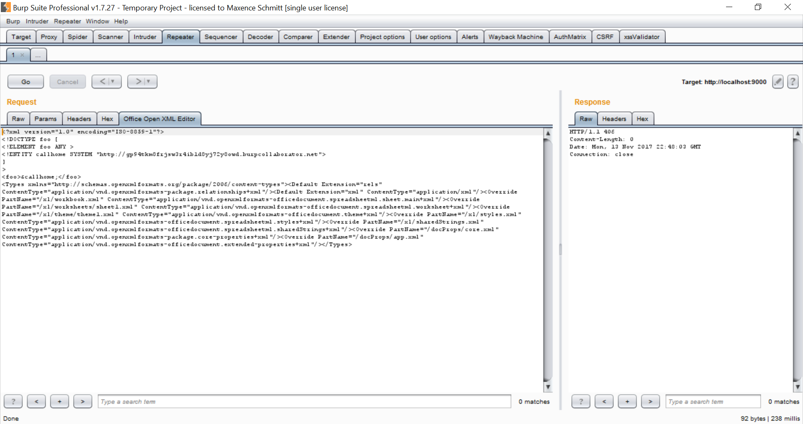

# Office Open XML Editor

Office Open XML Editor is a burp extension written in Python 2.7 that will allow you to edit Office Open XML(OOXML) file directly in Burp Suite. It will detect request with Office Open XML(docx,xlsx,pptx) and provide you tab to edit XML content which is present inside the document. I hope this will help you to exploit XXE(XML External Entity).

## Why
Some great tools are already existing to exploit xxe in OOXML document like:
* https://github.com/BuffaloWill/oxml_xxe
* https://buer.haus/xxegen/

The "issue" I faced is that I had to generate file using those tools and then upload it, if I wanted to try another payload I had to generate another file and upload it again, and so on. I wanted something that I can quickly edit in Burp to test some XXE payloads. That why I made this extension.

## Features
* Content-Type of OOXML can be edited in the configuration file(conf/conf.json).
* The file to edit inside the OOXML document is also define in the configuration file and can be change.
* Burp Collaborator can be used to find Out Of Band XXE.
* This extension will not be working in Intruder as CustomTab can't be used in Intruder.

## How to use it
* Install the burp extension "OfficeOpenXMLEditor.py".
* It will detect if there is any multipart POST request with OOXML Content-Type.
* If there is, "Open Office XML tab" will be added to your request.
* Edit the XML file and submit.
* If you want to open anothter file than "[Content_Types].xml" you can change the config file (conf/conf.json).

## OOXML Resources
* https://www.silentrobots.com/blog/2015/03/04/oxml_xxe/

## XXE Resources
* https://www.owasp.org/index.php/XML_External_Entity_(XXE)_Processing
* https://github.com/swisskyrepo/PayloadsAllTheThings/tree/master/XXE%20injections
* https://blog.zsec.uk/blind-xxe-learning/

## Author
* Maxence Schmitt(Sapic), Twitter: @maxenceschmitt
